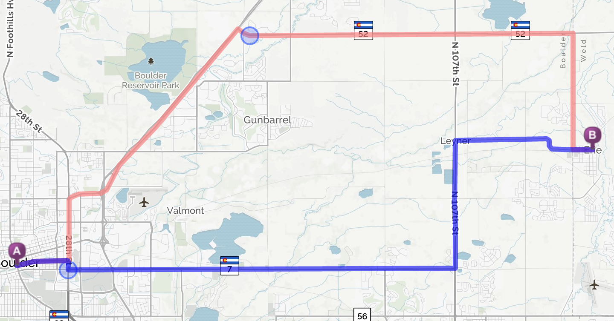

# mq-js-test
MapQuest midpoint problem

To view this repo start a webserver in the root directory. One way to do it: `python -m SimpleHTTPServer`.

The page should show two routes between Erie, CO and Boulder, CO. The circles are meant to represent the midpoint of each route. One of them is way off.
Can you figure out why? Start by looking in `midpoint.js`.

